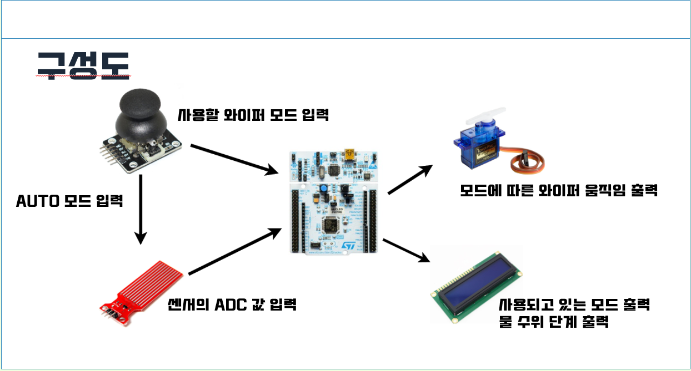
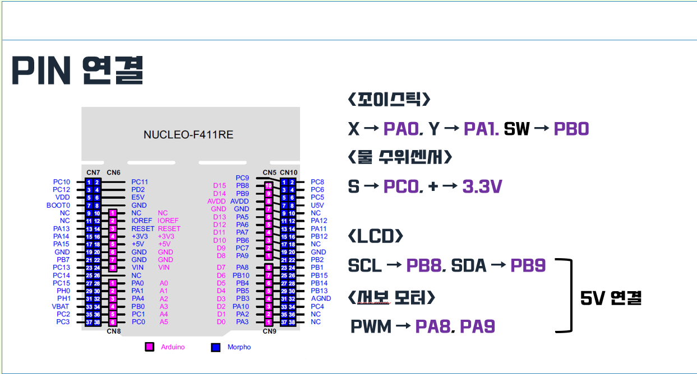
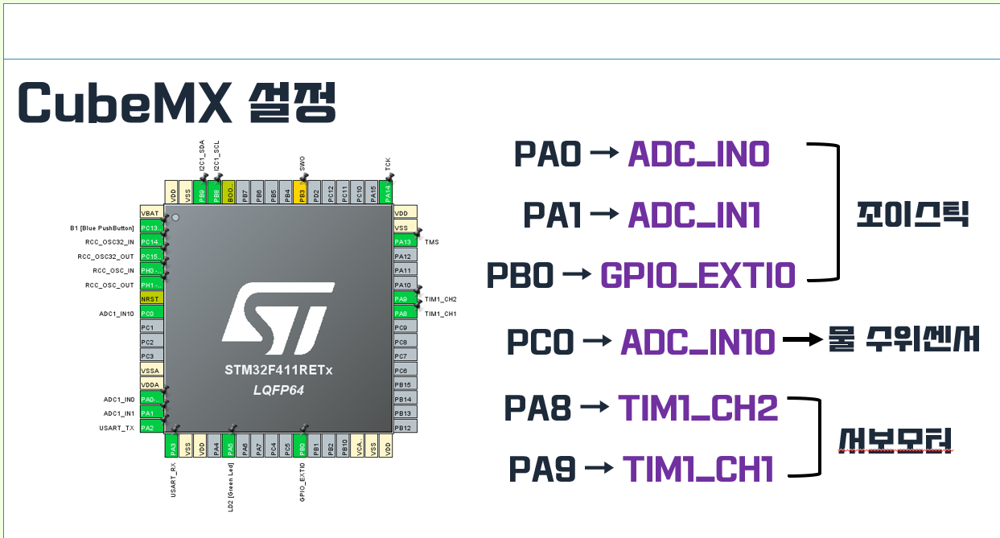
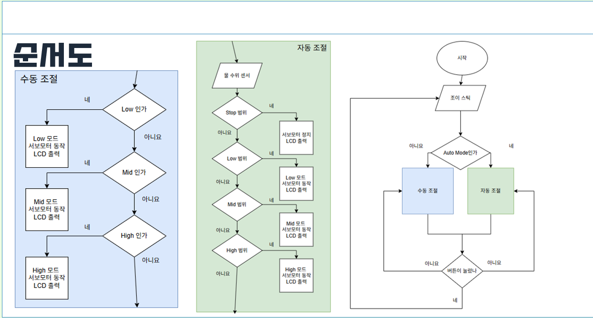

# STM32 자동차 와이퍼 수동·자동 제어 프로젝트

조이스틱과 물 수위 센서를 이용하여 자동차 와이퍼의  
**수동 조절 모드**와 **자동 조절 모드(Auto Mode)** 를 구현한 STM32F411 기반 프로젝트입니다.

---

## 1. 데모 영상

### 🔹 전체 동작 데모 (자동 + 수동)

  

### 🔹 추가 동작 데모 (수동 위주)

  

---

## 2. 프로젝트 개요

- **MCU** : STM32F411RE (NUCLEO-F411RE 보드)
- **입력 장치**
  - 조이스틱(X, Y, 버튼)
  - 물 수위 센서(빗물 양 측정)
  - Auto 모드 선택 스위치(조이스틱 버튼)
- **출력 장치**
  - 서보 모터 : 와이퍼 동작(속도/각도 제어)
  - 문자 LCD(I2C) : 현재 모드, 물 수위 단계 표시
- **주요 기능**
  - 조이스틱으로 Low / Mid / High 와이퍼 속도 **수동 제어**
  - 물 수위 센서의 ADC 값에 따라 속도를 자동으로 조절하는 **자동 제어**
  - Auto Mode 버튼으로 **수동 ↔ 자동 모드 전환**
  - LCD에 **현재 모드 + 수위 단계** 출력

---

## 3. 시스템 구성도

프로젝트 전체 구성을 그림으로 나타내면 아래와 같습니다.

  

- 조이스틱 → 사용자가 원하는 와이퍼 모드/속도 입력
- 물 수위 센서 → 빗물 양에 따른 ADC 값 입력
- STM32 보드 → 입력 신호를 해석하고 서보 모터 및 LCD 제어
- 서보 모터 → 와이퍼 동작 출력
- LCD → 현재 모드, 물 수위 단계 출력

---

## 4. 하드웨어 핀 연결

### 4-1. PIN 연결 개요

  

#### ⬛ 조이스틱

- X축 → **PA0**
- Y축 → **PA1**
- 버튼(SW) → **PB0**

#### ⬛ 물 수위 센서

- 센서 출력(S) → **PC0**
- VCC → **3.3V**

#### ⬛ LCD (I2C)

- SCL → **PB8**
- SDA → **PB9**
- VCC → **5V**

#### ⬛ 서보 모터

- PWM → **PA8**, **PA9**
- VCC → **5V**

---

## 5. CubeMX 설정

STM32CubeMX에서 사용한 주요 핀 설정입니다.

  

- **조이스틱 (ADC 입력)**
  - `PA0` → `ADC_IN0`
  - `PA1` → `ADC_IN1`
- **조이스틱 버튼**
  - `PB0` → `GPIO_EXTI0` (외부 인터럽트 입력)
- **물 수위 센서**
  - `PC0` → `ADC_IN10`
- **서보 모터 (타이머 PWM)**
  - `PA8` → `TIM1_CH2`
  - `PA9` → `TIM1_CH1`
- **I2C LCD**
  - `PB8` → I2C SCL
  - `PB9` → I2C SDA

---

## 6. 동작 순서도

프로그램의 전체 동작 흐름은 아래 순서도와 같습니다.

  

### 6-1. 수동 조절 모드

1. 조이스틱 입력을 읽어 **Low / Mid / High** 영역인지 판별
2. 선택된 모드에 맞는 PWM 듀티 비로 서보 모터 구동
3. LCD에 현재 모드(`Low / Mid / High`)를 출력

### 6-2. 자동 조절 모드

1. 물 수위 센서의 **ADC 값**을 주기적으로 측정
2. 수위 값이
   - **Stop 범위** → 서보 정지, LCD에 `Stop` 출력  
   - **Low 범위** → Low 속도로 서보 구동  
   - **Mid 범위** → Mid 속도로 서보 구동  
   - **High 범위** → High 속도로 서보 구동
3. 현재 수위 단계와 모드를 LCD에 출력

### 6-3. 모드 전환

- 시작 후 조이스틱 입력을 확인
- **Auto Mode인지 여부**를 판단하여
  - 아니면 → **수동 조절 플로우**
  - 맞으면 → **자동 조절 플로우**
- 버튼 입력이 들어오면 모드를 전환하거나 종료 플로우로 이동

---

## 7. 개발 환경

- **MCU 보드** : NUCLEO-F411RE
- **툴체인 / IDE**
  - STM32CubeIDE
  - STM32CubeMX
- **언어** : C
- **주요 주변장치**
  - 조이스틱 모듈
  - 물 수위 센서 모듈
  - 서보 모터 (SG90 등)
  - I2C 문자 LCD

---
